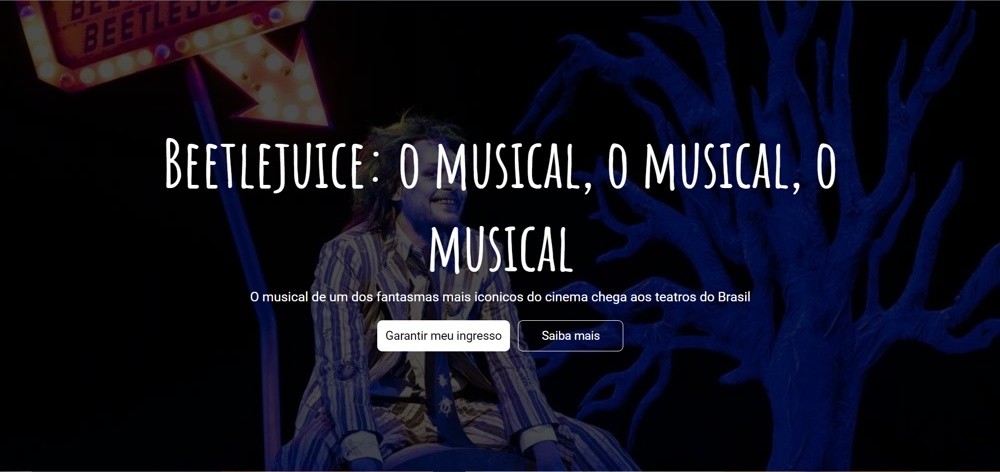

<h1 align="center">
Beetlejuice - Uma landpage para a estreia de um grande evento
</h1>

    

  <a href="#tecnologias">Tecnologias</a>&nbsp;&nbsp;&nbsp;|&nbsp;&nbsp;&nbsp;
  <a href="#projeto">Projeto</a>&nbsp;&nbsp;&nbsp;|&nbsp;&nbsp;&nbsp;
  <a href="#desafio">Desafio</a>&nbsp;&nbsp;&nbsp;|&nbsp;&nbsp;&nbsp;
  <a href="#o-que-aprendi">O que aprendi</a>&nbsp;&nbsp;&nbsp;&nbsp;&nbsp;&nbsp;

## 🚀 Tecnologias

Esse projeto foi desenvolvido com as seguintes tecnologias:

- HTML
- sass
- JavaScript
- Parcel
- Git e Github

## Projeto

O projeto se trata de uma landpage com foco em passar informações da peça de teatro da broadway. Como base sendo o musical "Beetlejuice - O musical, o musical, o musical" o programa foi criado para praticar estudos em estrutura de páginas front-end.

## Desafio

Como parte de um exercicio, o desenvolvedor deve ser capaz de:

- Criar um layout responsivo
- Criar uma seção onde mostra o timer até a data de estreia do evento
- Utilizar plugins para dar mais vida ao site estatico, como o "aos".

Veja o resultado através do <a href="https://beetlejuice-o-musical-landpage.vercel.app/">link do Vercel</a>

## O que aprendi

Com o objetivo de praticas mais a estruturação do css, com sass, e o javascript para controle da DOM, eu aprendi com este projeto a:

- Criar layouts responsivos com sass e a organiza-lo
- Utilizar a metodologia BEM para estruturar os nomes das classes e utiliza-las junto com o pré-processador  
- Utilizar o JavaScript, criando respostas para questões e desafios propostos para a dinâmica da página
